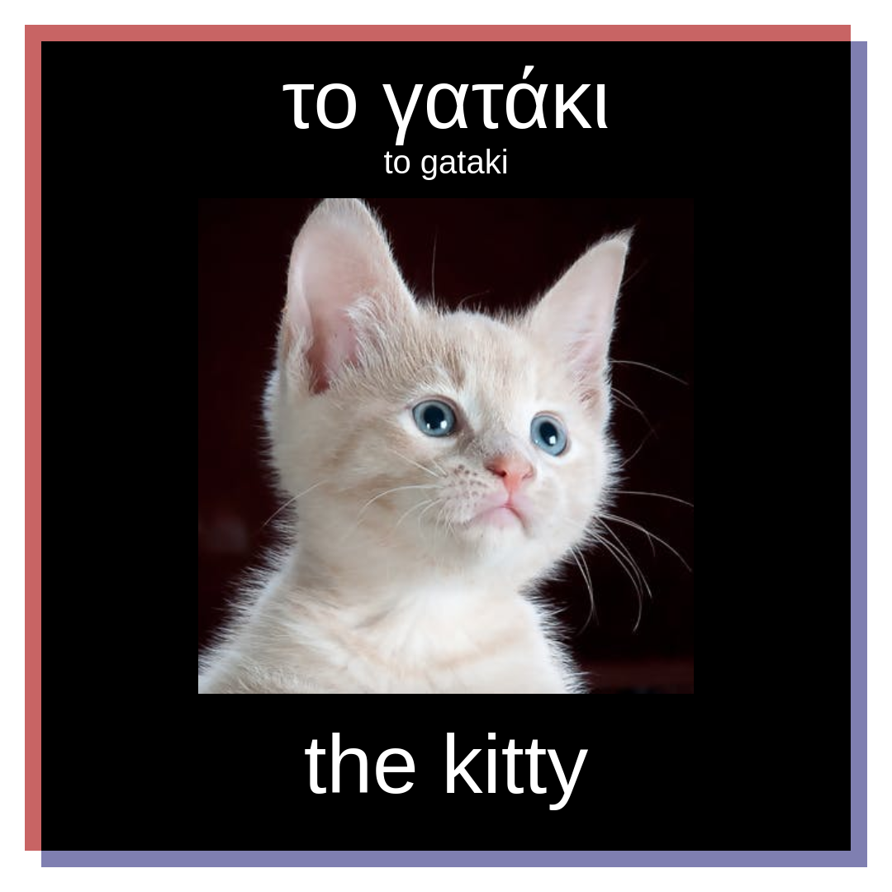

# Learn.ig

"Recipe card" generator to aid foreign language acquisition. Optimized for Instagram

Generated images are 1080x1080 pixels, in PNG format.

Limited transliteration support for Greek (EL) language.

## Installation

rvm install ruby-2.5.3
bundle install
ruby application.rb

## Usage

### Basic

Navigate your browser to http://localhost:4567/el/generate/kitten

Choose an image (select an area from one of the available images)

Click on 'Save Image' -- image will be saved to images/el/kitten.png

### Antonyms

Navigate your browser to http://localhost:4567/el/antonym/hot,cold

Choose two images (select an area from one of the available images)

Click on 'Save Image' -- image will be saved to images/el/hot_cold.png

### Quiz

Navigate your browser to http://localhost:4567/el/antonym/kitten

Choose an image (select an area from one of the available images)

Click on 'Save Image' -- image will be saved to images/el/kitten_quiz.png

### Multigen (basic multiplexed)

Navigate your browser to http://localhost:4567/el,de,tr,sq/multigen/kitten

Choose an image (select an area from one of the available images)

Click on 'Save All' -- images will be saved to images/<<locale>>/kitten.png

## Example

